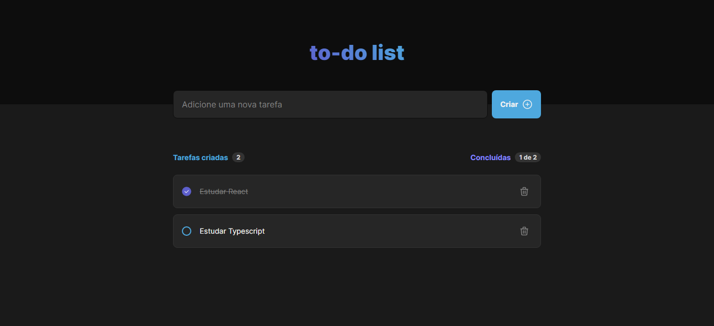

<h1 align="center">ToDo List</h1>

 

  

## 💡 Sobre o projeto

O objetivo desse projeto é praticar alguns dos conceitos mais importantes da biblioteca ReactJS.
A aplicação consiste em uma lista de tarefas, na qual o usuário pode adicionar, remover e marcar suas tarefas como concluídas.

🔗 [Clique aqui](https://todo-list-edusmpaio.vercel.app/) para acessar o projeto.

## 🚀 Tecnologias utilizadas

- [React](https://pt-br.reactjs.org/)
- [TypeScript](https://www.typescriptlang.org/)

## 🖼️ Layout

O layout utilizado como base para a realização do projeto encontra-se [nesse link](<https://www.figma.com/file/AUtAJ28ZypXVOwz2Vb54Ge/ToDo-List-(Copy)?node-id=0%3A1>).

É necessário ter uma conta no [Figma](https://figma.com) para ter acesso.
